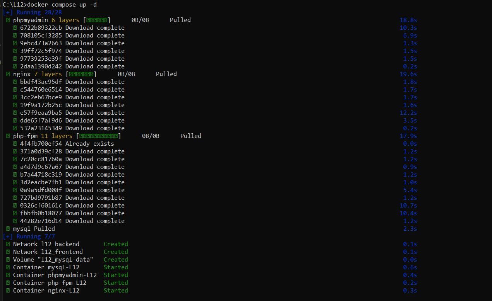

# Sprawozdanie z zadania OB Laboratorium 12 połączonego z NOB Laboratorium 13

## Wyjaśnienia
### 1. Tagowanie
Dla zgodności z dobrymi praktykami Docker'a używam konkretnych wersji tagów zamiast tagu :latest.

### 2. Sieci serwera phpMyAdmin
Aby zapewnić komunkiację serwera phpMyAdmin z serwerem MySQL wymagane jest dołączenie go do tej samej sieci ("backend").
W teorii dobrą praktyką było by dołączyć go też do sieci "frontend" aby zapewnić zwiększone bezpieczeństwo przy większej 
ilości sieci do separacji ruchu, tak aby komunikacja między użytkownikiem a localhost:6001 przebiegała bez zarzutów.
W praktyce ze względu na zdefiniowanie w docker-compose mapowania portów dla phpMyAdmin przy tylko dwóch sieciach w tym rozwiązaniu,
nawet bez dołączenia sieci "frontend" dostęp do localhosta będzie zapewniony przez silnik Dockera.

### 3. Secrets
Hasła nie są przekazywane w pliku docker-compose, a znajdują się w oddzielnych plikach secrets.

## Obsługa projektu i sprawdzenie poprawności rozwiązania
Komendy wykonujemy z pozycji katalogu głównego z plikiem docker-compose.yml.

### 1. Uruchomienie
  ```bash
  docker compose up -d
  ```
Rezultat:


### 2. Sprawdzenie stanu kontenerów 
  ```bash
  docker compose ps
  ```
Rezultat:


### 3. Sprawdzenie strony index.php w przeglądarce
  Wejście na stronę główną PHP z konfiguracją serwera PHP na serwerze ([http://localhost:4001](http://localhost:4001))


### 4. Sprawdzenie strony phpMyAdmin w przeglądarce
  Wejście na stronę główną phpMyAdmin ([http://localhost:6001](http://localhost:6001))


### 5. Sprawdzenie strony phpMyAdmin z zalogowaniem na użytkownika (testuser)
Po pomyślnym zalogowaniu, widać utworzoną bazę "bazatestowa" zainicjowana ze zmiennej środowiskowej (MYSQL_DATABASE). 
Dodatkowo testuser nie ma uprawnień do utworzenia nowej bazy danych


### 6. Sprawdzenie strony phpMyAdmin z zalogowaniem na użytkownika (root)
Po pomyślnym zalogowaniu, widać wcześniej utworzoną bazę "bazatestowa", a z racji tego że mamy uprawnienia do tworzenia baz,
można było utworzyć nową bazę "bazaROOT".


### 7. Potwierdzenie wykorzystania secrets
Potwierdzenie, że sekret został powiązany z serwisem za pomocą mechanizmu bind mounts, przez polecenie:
 ```bash
  docker inspect mysql-L12
  ```
  i wyszukanie pozycji Mounts:

